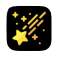
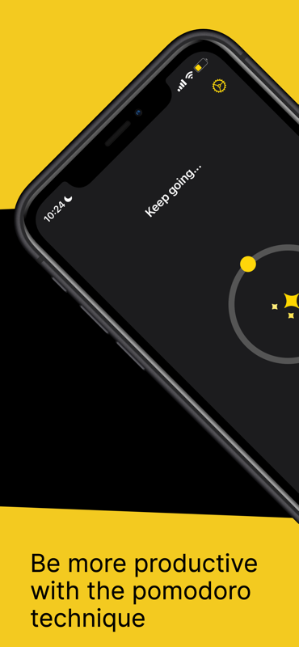
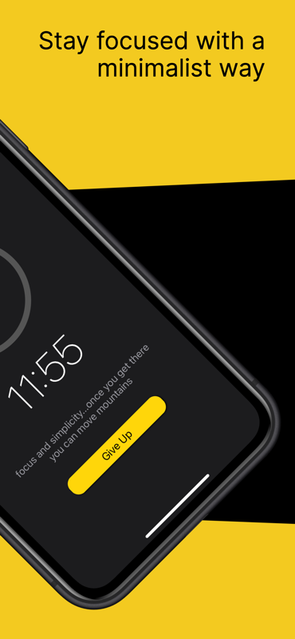
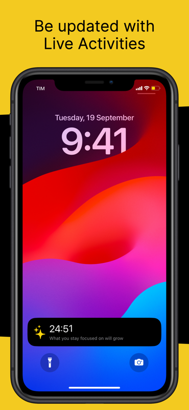
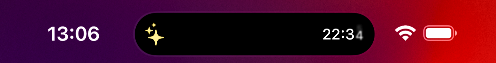
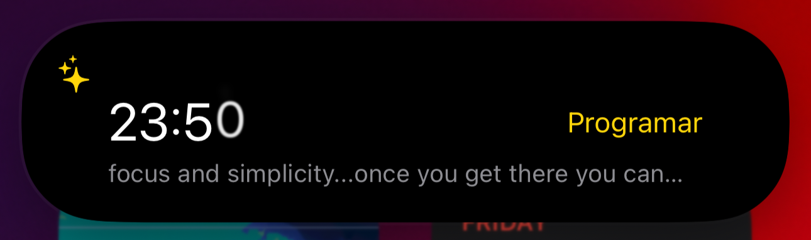

  
  <h1 align="center"> Star Pomodoro </h1>

 Mantenha o foco com Star Pomodoro, uma forma minimalista de focar.
  
 Muito obrigado a todo(as) responsáveis pelos mais de 500+ downloads do Star Pomodoro 

  

  <a href="#-o-que-é">O que é?</a> •
  <a href="#-funcionalidades">Funcionalidades</a> •
  <a href="#-ios">iOS</a> •
  <a href="#-watch">Watch</a> •
  <a href="#-dynamic-island">Dyanmic Island</a> •
  <a href="#-autores">Autor</a>

### 🧐 O que é?

Star Pomodoro é uma solução que visa ajudar com o foco, utilizando a técnica Pomodoro. 

### 👾 Funcionalidades

- [x] Mantenha o foco para completar suas tarefas.
- [x] Aplicativo Apple Watch para manter o foco mesmo sem o iPhone, diretamente do pulso.
- [x] Notificações para alertá-lo quando for hora de fazer uma pausa.
- [x] Suporte para atividades ao vivo.
- [x] Selecione o tipo de frase que deseja motivar você a se concentrar.
- [x] [App Store]([https://apps.apple.com/br/app/supernova-rocket-launches/id6448315571](https://apps.apple.com/us/app/star-pomodoro/id6466343741?l=pt-BR))

### 📱 iOS 

     
     
     

## Especificações Técnicas 🛠

As seguintes tecnologias foram utilizadas neste projeto:    

* [x] Swift 5.7
* [x] Arquitetura MVVM
* [x] UIKit
* [X] View Code 
* [x] URLSession
* [X] Push Notifications
* [X] Background Tasks 

### 🕐 Watch

     
     
     

## Especificações Técnicas 🛠

As seguintes tecnologias foram utilizadas neste projeto: 

* [x] Swift 5.7
* [x] Arquitetura MVVM
* [x] SwiftUI
* [x] Alamofire

### 🪟 Dynamic Island

Além de tudo isso, o Star Pomodoro tem suporte a live activities e a dynamic island. 

     
     

### 😌 Autores

* Henrique Ferreira Marques Costa

  Desenvolvedor iOS a quase 3 anos, apaixonado por criar aplicativos excepcionais que fazem a diferença.

<table align="center">
  <tbody>
    <tr>
      <td align="center" valign="top" width="14.28%"><a href="https://github.com/RickyMarq"> <b>Henrique M</b></a> <a href="https://github.com/RickyMarq" </td>
    </tr>
  </tbody>
</table> 
